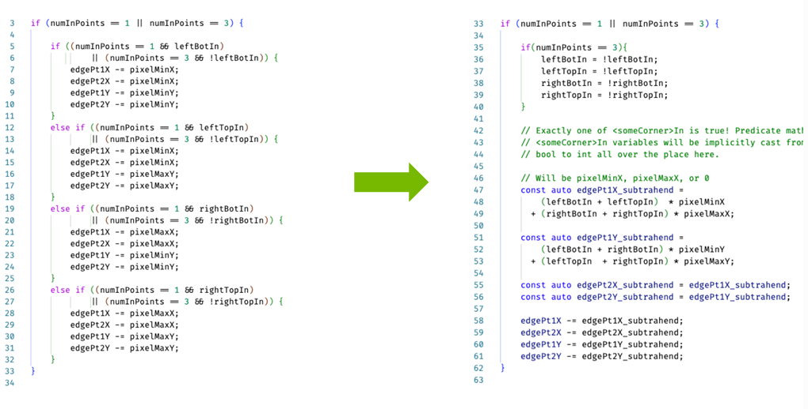

# CUDA优化：最大化计算和指令的吞吐
link：https://register.nvidia.com/flow/nvidia/gtcs25/vap/page/vsessioncatalog/session/1727709629316001myds


# GPU 线程层级化，SIMT，warp 发散
下图为H100的整体架构：


流处理器（SM）：

SM有四个子区域 (下述数据针对的是整个SM)：

+ 128 fp32 units
+ 64 fp64 ... 
+ 64 int32 ...
+ 4 混合精度 tensor cores
+ 16 特殊函数 uints
+ 4 warp scheduler

+ 32 LD/ST units
+ 64K 32-bit registers
+ 256KiB 统一的 L1 data cache and shared memory
+ tensor memory accelerator(TMA)


线程层级： grid & blocks

一个cuda kernel 是一个被launch thread blocks的grid，blocks的工作可以完全独立地完成。

blocks是在每个SM上执行：

+ 一些blocks将会并发地位于一个SM上
+ blocks不能迁移到别的SM
+ 在SM上的每个block可以以任意顺序进行调度

Hopper引入了一个新的线程层级：clusters；一个cluster的blocks可以并发地进行调度，并且对于cluster内跨越多个SM的线程来说，能够高效的协作以及数据共享。


线程层级：warps

+ 1 warp = 32 threads；
+ 在运行时，一个block将被划分为warps获得SIMT的执行；
+ 一个warp中的线程有连续的线程id；一个block的warps数量可以通过 `ceil(threads per block / warp size)` 定义。

SIMT架构

+ 每个线程有自己的PC（程序计数器）
+ SIMT = SIMD + PC
+ 如果一个warp内的线程发散（例如，通过条件分支），这个warp将会分离地执行每个分支路径
+ 当warp中的32 个线程都执行同一个路径，就会获得完全的效率


ncu中的提示信息如下：


可以在source page 查看每条指令warp有多么converge。


减少warp 发散的tips：

一些共通的原因：

+ 每个线程的工作不同
    + sol：queue and bin/sort the work
+ Per thread work discovered at different times.
    + sol：queue the work
+ 每个线程在不同时间点结束
    + sol：划分为多个kernel

概念上的发散最好通过变化数据，而不是变化控制流


在shared memory中的work queueing

想象你在沙滩上寻宝，手拿金属探测仪和铁锹，切换这两个工具是十分耗时的；一种策略是只要探测仪有信号，那就切换到铁锹；另一种策略是先标记好每个有信号的地方，等有足够多的标记时切换到铁锹，这可以显著减少开销。

gpu上也有类似的workload，一个expensive的运算通过一个轻量化的if来guard；naive的实现可能导致并不是所有的线程都会通过这个if来进入运算。

解法：当有一个线程发现了需要deep dive的时候，先将其加入到队列中，之后继续工作；定期队列中的所有线程进行工作

```cpp
constexpr int k_block_size = 64; 

constexpr int k_capacity_factor = 3;
constexpr int k_queue_capacity = k_block_size * k_capacity_factor;

constexpr int k_queue_process_size = k_block_size * (k_capacity_factor - 1);

using Work_item_t = int;

__device__
void process_queue(Work_item_t (&block_queue) [k_queue_capacity], int &block_queue_size) {

    for (int queue_idx = threadIdx.x; queue_idx < block_queue_size; queue_idx += blockDim.x) {
        const Work_item_t work_item = block_queue[queue_idx];
        // 
    }

    __syncthreads();

    if (threadIdx.x == 0) {
        block_queue_idx = 0;
    }
    __syncthreads();
}
```

```cpp
__global__ void scout_and_dive_kernel() {
    __shared__ int block_num_threads_finished_scouting;
    __shared__ Work_item_t block_queue[k_queue_capacity];
    __shared__ int block_queue_size;

    const auto &is_thread_finished_scouting = [] () {return false;  /*your condition*/}

    while (block_num_threads_finished_scouting < k_block_size) {
        if (block_queue_size >= k_queue_process_size) {
            process_queue(block_queue, block_queue_size);
        }

        if (!is_thread_finished_scouting()) {
            // performing scouting work

            const bool found_dive = false; // your condition
            if (found_dive) {
                const Work_item_t work_idx = 0;
                const auto queue_write_dst = atomicAdd(&block_queue_size, 1);
                block_queue[queue_write_dst] = work_idx;
            }

            // advance the next scouting work

            if (!is_thread_finished_scouting()) {
                //
            } else {
                atomicAdd(&block_num_threads_finished_scouting,1);
            }
        }
        __syncthreads();
    }
    // flush queue at end
}

```


注意有几个函数需要解释：

+ `AtomicAdd`：从指定位置（shared memory / global memory）读取old值，将这个old值加上给定的value，最后存入这个位置中；函数返回的是**old**值

减少warp发散：使用数据流实现概念上的发散

```cpp
float x = 0.0f;
if (isA) {
    x = valA;
} else if (isB) {
    x = valB;
}

// prefer
float x = (isA) * valA + (isB) * valB;
```

一个更复杂的例子如下：



bonus: 动态block维度。（不是线程发散，更像是 block发散）

存在一类图像处理的workload，其中每个block将处理一个polygon；每个线程处理对应的 （pixel_x, pixel_y, poly_edge）一个伪代码如下：

```cpp
for (int x_idx = threadIdx.x; x_idx < x_size; x_dix += blockDim.x) {
    ... 
}
```
可能存在的问题：ploygen的特征，如x_size等如果变化很大；导致无法充分利用线程块。


一个动态的解法：(变换block的形状)
```cpp
const auto polygon_idx = blockIdx.x;

const auto x_size = ...;

dim3 vBlockDim(1,1,1);
const auto threads_allocated = 1;
// fill x
while(vBlockDim.x < x_size && threads_allocated < blockDim.x) {
    vBlockDim.x *= 2;
    threads_allocated *= 2;
}
// fill y and e
...

dim3 vThreadIdx;
vThreadIdx.x = threadIdx.x % vBlockDim.x;
vThreadIDx.y = (threadIdx.x / vBlockDim.x) % vBlockDim.y;
//
for (int x = vThreadIdx.x; x < x_size; x += vBlockDim.x) {
    //
}
```

# warp 调度和kernel profile

每个SM中有四个warp scheduler；每个scheduler管理一个warps pool（Hopper：每个scheduler有16个warps 插槽）；每个时钟周期，每个scheduler都可以对一个warp发射出一条指令。

## warp scheduler的统计数据

首先建立一个profiling的心智模型：

warp有五个状态：
+ unused
+ active: warp在处理器上
+ stalled: warp正在等待先前指令完成；或者等待其下一条指令所需要的输入数据
+ eligible：warp执行下条指令所需要的数据都已经readyle
+ selected： eligible & 这一周期被scheduler选择发出指令


latency bound kernel: 每个scheduler只有一个活跃warp

例子：每个线程累加 pi 10000 次 使用双精度

```cpp
__global__ void kernel_A(double* A, int K) {
    double result = 0.0;
    for(int j=0; j<K; ++j) {
        result += 3.14;
    }
    int i = blockIdx.x * blockDim.x + threadIdx.x;
    A[i] = result;
}

kernel_A<<<1, 32>>>(d_f64, 1000);
cudaDeviceSynchronize();
```


上图可以看到一个double-point add需要花费8个时钟周期；注意此时还应该考虑SM中一个分区的f64单元的数量。这些数据在ncu的表现如下：


注意有两个关于GPU最好的性质：

1. 首先是SIMD
2. 但是更重要的是超线程(hyperthreading)：

    + warps 可以分时使用处理器的资源，掩盖相互之间的延迟；使得硬件资源一直繁忙
    + warps之间的切换从软件视角看是免费的

## kernel profiling
何时优化会做完：
+ 实践上使用Amdahl‘s law。 当代码相比于系统的其他部分不是瓶颈
+ 理论上：当所有被执行的work都是绝对必要的，并且负责这个work的硬件单元都充分利用或者占用。


四类性能限制：


roofline model


ncu source page：给定你的bounding 类型，应该关注那些列？


# 延迟隐藏 / 增大指令吞吐
TODO