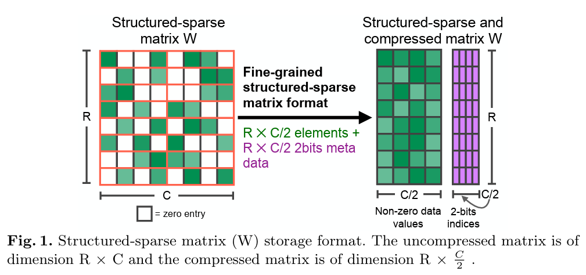
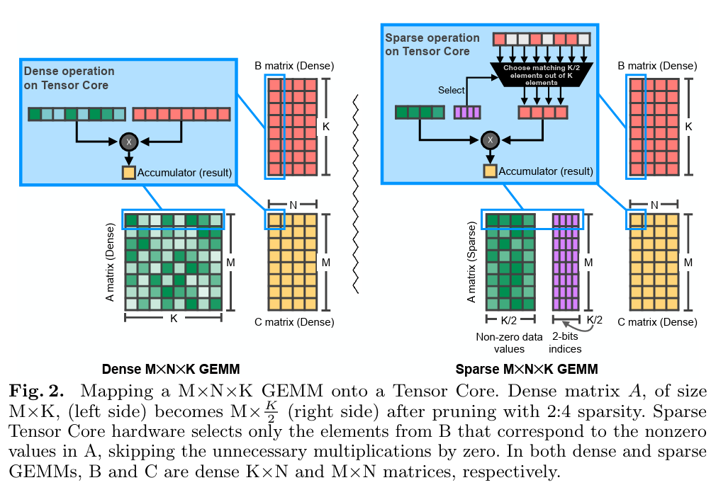
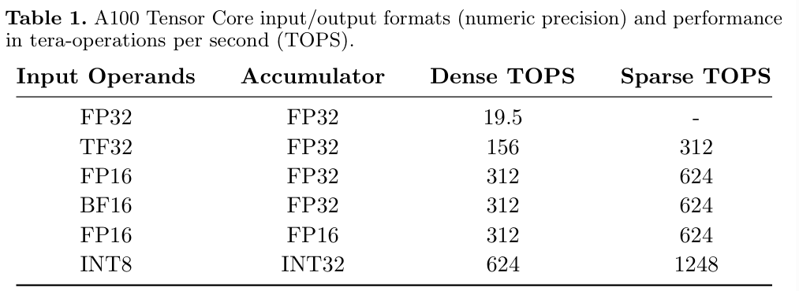
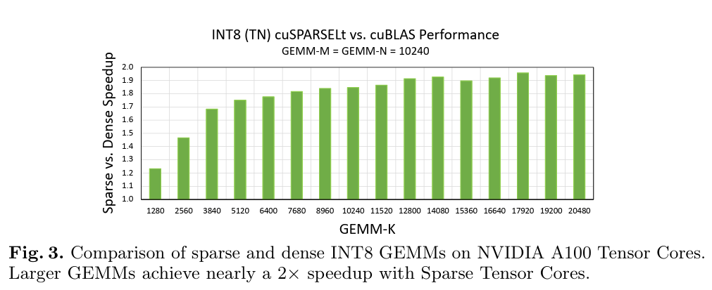
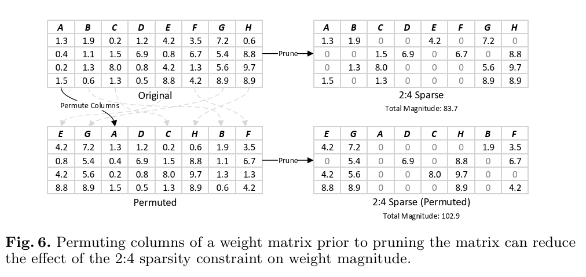

# 论文阅读：accelerating sparse deep neural networks
link: https://arxiv.org/abs/2404.01847

# 1. Intro
模型参数量很大，每个输入需要的计算操作也比较多；剪枝(prune)技术通过将特定的参数值置为0来引入模型的稀疏性，可以减少模型的存储以及计算方面的需求。

现有方法的局限性：难以维持精度的同时获取速度的提升。

这篇论文主要描述一种 **2:4** 的稀疏模式，这可以使得模型的参数量减半，要求每4个连续的值至少包括两个0值。也将描述在维持精度的同时，如何对传统的、稠密的模型进行这种模式的剪枝。这一流程先修剪一次稠密模型的参数，之后使用固定的稀疏模式重复训练过程。除此之外，我们还将讨论 nvdia ampere arch中引入的sparse tensor core，可以加速`2:4` 稀疏矩阵的计算。sparse tensor cores 可以有双倍的吞吐量提升，当第一个参数是压缩的 `2:4` 稀疏矩阵。

这篇论文的贡献：

1. 细粒度的 `2:4` 结构化剪枝方法
2. 一种在内存中存储剪枝tensor的压缩格式
3. 加速 `2:4` sparse tensor 的硬件架构
4. 重新训练剪枝后的权重的工作流

# 3. nvidia ampere 中的稀疏性支持
`2:4` 模式意味着对于每4个值的group，至少有两个必须为0值。这个模式有以下几个好处：

+ 高效的内存访问
+ 低开销的压缩格式
+ 2倍的吞吐量提升

## 3.1 `2:4` 稀疏性以及它的好处

如上图所示，在每4个一组的值中只有两个非零值需要存储；解码压缩格式的元数据被分离存储，使用两个bit来编码每个非零值的位置信息；例如第一行的元数据为 `[[0, 3], [1, 2]]`. 当执行矩乘操作时，元数据信息将会从第二个矩阵中抽取。

**高效内存访问**：非结构的稀疏模式在访问内存时，会导致cache lines的低利用率；未能充分利用内存带宽。更进一步，非结构化的模式通常使用 `CSR/CSC/COO` 的存储模式，这会导致数据相关的访问，因此会增加矩阵读取的延迟。与之相对的，`2:4` 稀疏性在大矩阵的每个子block有相同级别的稀疏性，可以使得硬件充分利用大的矩阵读。

**压缩格式效率**：非结构稀疏性使用 CSR格式 会引入存储的开销，这是由于200%的元数据开销（考虑8 bit的量化权重：列索引通常要求16bits或是更多bit。）

## 3.2 tensor core上的结构稀疏的gemm
nvidia ampere 扩展了tensor core来处理`2:4` 稀疏性，主要允许第一个参数使用sparse format存储；因此sparse tensor core执行的运算是 sparse matrix x dense matrix = dense matrix. 

上图展示了稀疏gemm如何映射到tensor core上；50%的稀疏性使得需要的multiply-and-add 操作减半，导致2倍的性能提升。

注意应用程序应该负责确保第一个操作数是 `2:4` 模式的压缩格式。

# 4. 网络剪枝工作流
这里我们只讨论权重剪枝一节。

如上图所示，如果我们直接剪枝这个权重矩阵，那么我们total magnitude只有83.7，这个值的计算是将矩阵中的所有值进行累加，这种剪枝方法会使得我们丢失一些大的值；解决这一问题的方法是通过permute 矩阵的列，使得大的值可以更均匀的分布。在进行这一permute之后，为了维持gemm的正确结果，我们也需要对激活值（矩乘计算的右值按行进行排序。假设A的列向量为 $a_i$, B的行向量为 $b_i$, A@B = $\sum_{i} a_i \times b_i $，由这个公式可以看出我们也需对激活值的行进行排序）。如何对激活值的行进行排序？我们需要考虑生成这个激活值的矩乘 A_，这里即将 A_ 的行进行排序即可。

# COO 与 CSR 存储模式

COO：本质是三元组，`(row, col, data)`, 前两个可以表示元素在矩阵的坐标

CSR: 三个数组，index pointers, indices, data. 其中在index pointers中，第i和i+1个元素表示第i行的元数据，可以获取对应indices中的索引，比如如果为2和3，那么可以得到indices中第三个位置的元素，这个值表示第i行的这一列存在值value。data对应的就是具体的数据。